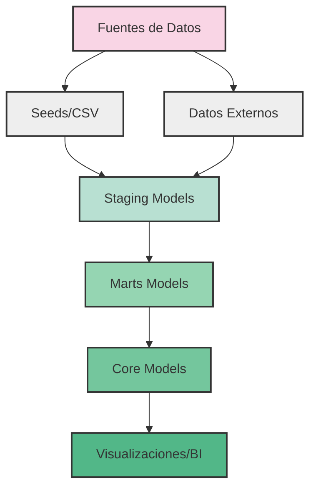
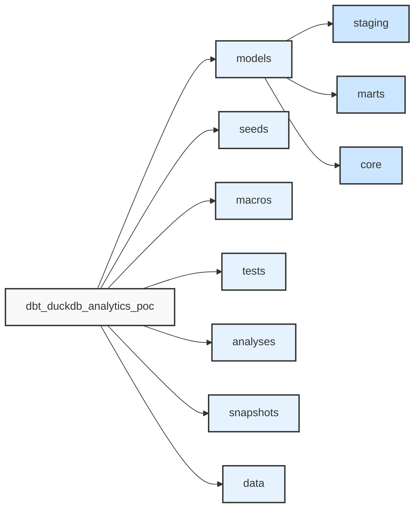
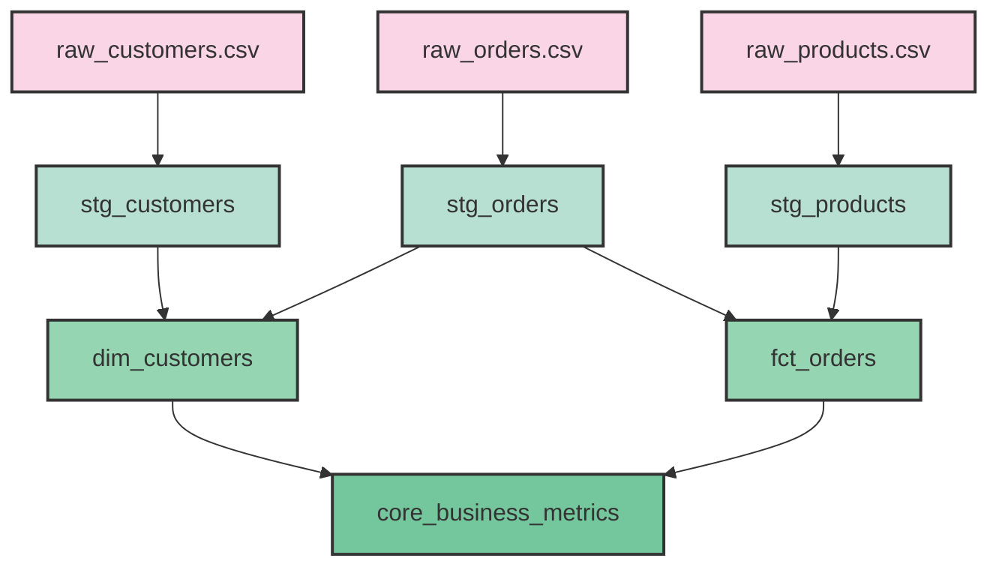

# DBT con DuckDB - Análisis de Datos Local

Este proyecto es una implementación completa de DBT (Data Build Tool) con DuckDB para realizar análisis de datos de forma local y eficiente, sin necesidad de una infraestructura compleja.

## Índice
- [Introducción](#introducción)
- [Arquitectura](#arquitectura)
- [Instalación](#instalación)
- [Estructura del Proyecto](#estructura-del-proyecto)
- [Flujo de Trabajo](#flujo-de-trabajo)
- [Análisis de Datos](#análisis-de-datos)
- [Trabajo con Snapshots](#trabajo-con-snapshots)
- [Entornos Múltiples](#entornos-múltiples)
- [Técnicas Avanzadas](#técnicas-avanzadas)
- [Solución de Problemas](#solución-de-problemas)
- [Integración con Python](#integración-con-python)
- [Exportación de Datos](#exportación-de-datos)
- [Mejores Prácticas](#mejores-prácticas)
- [Contribuir](#contribuir)
- [Licencia](#licencia)
- [Recursos Adicionales](#recursos-adicionales)

## Introducción

### ¿Qué es DBT?

DBT (Data Build Tool) es una herramienta de transformación de datos que permite a los analistas y científicos de datos transformar datos de manera eficiente utilizando SQL. DBT se encarga de la orquestación, documentación y pruebas, permitiéndote concentrarte en escribir transformaciones.

### ¿Qué es DuckDB?

DuckDB es una base de datos analítica embebida, diseñada para ser rápida, eficiente y fácil de usar. Es particularmente buena para análisis de datos y consultas OLAP (Online Analytical Processing), y puede funcionar como un archivo independiente similar a SQLite.

### ¿Por qué utilizar DBT con DuckDB?

La combinación de DBT con DuckDB ofrece:
- Un flujo de trabajo de datos completamente local y portátil
- Transformaciones eficientes y rápidas
- Facilidad para modelar y transformar datos
- Capacidad de trabajar sin conexión
- Estructura modular y testeable para el código SQL

## Arquitectura

La arquitectura de este proyecto sigue los principios de modelado dimensional y el patrón de medallón (bronze, silver, gold) para procesar y transformar datos:



## Estructura del Proyecto



El proyecto está organizado en las siguientes componentes:

```
dbt_duckdb_analytics_poc/
├── models/             # Modelos SQL para transformación de datos
│   ├── staging/        # Modelos iniciales de limpieza
│   ├── marts/          # Modelos dimensionales para casos de uso
│   └── core/           # Modelos finales de alto nivel
├── analyses/           # Consultas SQL exploratorias
├── macros/             # Funciones SQL reutilizables
├── seeds/              # Archivos CSV de datos iniciales
├── snapshots/          # Capturas de cambios en datos
├── tests/              # Pruebas de calidad de datos
├── data/               # Directorio donde se almacena el archivo DuckDB
├── target/             # Archivos generados por DBT (ignorado en Git)
├── dbt_project.yml     # Configuración principal del proyecto
├── profiles.yml        # Configuración de conexión a DuckDB
└── README.md           # Documentación del proyecto
```

## Instalación

### Requisitos Previos

- Python 3.8 o superior
- pip (gestor de paquetes de Python)
- Git

### Paso a Paso

1. **Clonar el repositorio**:
   ```bash
   git clone https://github.com/tu-usuario/dbt-duckdb-analytics-poc.git
   cd dbt-duckdb-analytics-poc
   ```

2. **Crear entorno virtual e instalar dependencias**:
   ```bash
   # En macOS/Linux
   python3 -m venv venv
   source venv/bin/activate

   # En Windows
   python -m venv venv
   venv\Scripts\activate

   # Instalar dependencias
   pip install -r requirements.txt
   ```

3. **Configurar perfil de DBT**:
   ```bash
   mkdir -p ~/.dbt
   cp profiles.yml ~/.dbt/
   ```

## Flujo de Trabajo

### 1. Inicializar Datos con Seeds

Los seeds son archivos CSV que se cargan directamente en la base de datos:

```bash
dbt seed
```

Este comando carga los archivos CSV de la carpeta `seeds/` en DuckDB.

### 2. Ejecutar Modelos

Ejecutar todos los modelos:
```bash
dbt run
```

Ejecutar un modelo específico:
```bash
dbt run --select dim_customers
```

Ejecutar modelos en una capa específica (usar comillas para escapar el asterisco):
```bash
dbt run --select "staging.*"
```

### 3. Ejecutar Pruebas

Las pruebas garantizan la calidad e integridad de los datos:

```bash
# Ejecutar todas las pruebas
dbt test

# Ejecutar pruebas para un modelo específico
dbt test --select dim_customers
```

### 4. Generar Documentación

```bash
# Generar documentación
dbt docs generate

# Servir documentación en un servidor web local
dbt docs serve
```

La documentación generada incluye:
- Lineage (diagrama de dependencias entre modelos)
- Definiciones de columnas
- Pruebas asociadas a cada modelo
- Código SQL subyacente

## Análisis de Datos

Este proyecto incluye diversos análisis listos para usar. Para ejecutarlos:

1. **Compilar los análisis**:
   ```bash
   dbt compile
   ```

2. **Ejecutar un análisis específico**:
   ```bash
   python run_analysis.py customer_analysis
   ```

Análisis disponibles:
- `customer_analysis` - Comportamiento de clientes y segmentación
- `customer_orders_analysis` - Análisis detallado de patrones de compra
- `product_performance` - Rendimiento de productos por categoría
- `order_trends_by_time` - Tendencias de ventas a lo largo del tiempo
- `revenue_trends` - Análisis de ingresos por producto y período
- `snapshot_history` - Historial de cambios en los datos

Para guardar resultados en un archivo CSV:
```bash
python run_analysis.py customer_analysis --save
```

## Diagrama de Dependencias de Modelos



## Trabajo con Snapshots

Los snapshots capturan cambios en los datos a lo largo del tiempo, implementando el patrón SCD tipo 2:

```bash
# Ejecutar todos los snapshots
dbt snapshot
```

Esto creará tablas en el esquema `snapshots` que capturan el historial de cambios con columnas adicionales:
- `dbt_valid_from`: Fecha/hora desde cuando el registro es válido
- `dbt_valid_to`: Fecha/hora hasta cuando el registro es válido (NULL si es la versión actual)
- `dbt_updated_at`: Marca de tiempo usada para el seguimiento
- `dbt_scd_id`: Identificador único para cada versión del registro

### Consultar Snapshots

Para ver los datos históricos:

```bash
# Consultar todos los registros de un snapshot
python run_query.py "SELECT * FROM snapshots.customers_snapshot ORDER BY customer_id, dbt_valid_from"

# Consultar solo registros actuales (versiones vigentes)
python run_query.py "SELECT * FROM snapshots.customers_snapshot WHERE dbt_valid_to IS NULL"

# Ver el historial de cambios de un registro específico
python run_query.py "SELECT * FROM snapshots.customers_snapshot WHERE customer_id = 1 ORDER BY dbt_valid_from"
```

Para un análisis más detallado de los cambios históricos:
```bash
python run_analysis.py snapshot_history
```

> **Nota**: En DuckDB, usa `current_timestamp` (sin paréntesis) en lugar de `current_timestamp()` en tus archivos de snapshot.

## Entornos Múltiples

El proyecto está configurado para soportar múltiples entornos:

```bash
# Desarrollo
dbt run --target dev

# Staging
dbt run --target staging

# Producción
dbt run --target prod
```

Cada entorno utiliza un archivo DuckDB diferente para aislar los datos.

## Técnicas Avanzadas

### Macros Personalizadas

Ejemplo de macro para formatear fechas:

```sql
-- macros/format_date.sql

    TO_CHAR({{ date_column }}, 'YYYY-MM-DD')

```

Uso:
```sql
SELECT {{ format_date('order_date') }} AS formatted_date
FROM {{ ref('fct_orders') }}
```

### Plantillas Jinja

DBT utiliza Jinja2 para hacer el SQL más dinámico:

```sql

    SELECT 
        '{{ category }}' as category,
        SUM(total_revenue) as revenue
    FROM {{ ref('product_performance') }}
    WHERE product_category = '{{ category }}'
    UNION ALL

```

### Materialización Incremental

Para tablas grandes que crecen con el tiempo:

```sql
{{
    config(
        materialized='incremental',
        unique_key='order_id'
    )
}}

SELECT * FROM {{ ref('stg_orders') }}


    WHERE order_date > (SELECT MAX(order_date) FROM {{ this }})

```

## Solución de Problemas

### Compilación sin Ejecución

Para ver el SQL generado sin ejecutarlo:

```bash
dbt compile --select my_model
```

El SQL compilado estará en `target/compiled/{proyecto}/{modelo}.sql`.

### Conflictos con Funciones de Fecha/Hora en DuckDB

Si encuentras errores relacionados con funciones de fecha en DuckDB:
- Usa `CAST(columna AS DATE)` en lugar de `DATE(columna)`
- Usa `current_timestamp` sin paréntesis, no `current_timestamp()`

### Errores Comunes y Soluciones

1. **Error con nombres de columnas**: Verifica que los nombres de columnas en tus transformaciones coincidan con los nombres reales en las tablas. Puedes usar `DESCRIBE tabla` para verificar.

2. **Error con ORDER BY y UNION ALL**: En DuckDB, cuando se utiliza ORDER BY o LIMIT dentro de una subconsulta que forma parte de UNION ALL, encierra la subconsulta entre paréntesis.

### Depuración con --vars

Puedes pasar variables a tu proyecto:

```bash
dbt run --vars '{"min_date": "2023-01-01", "max_date": "2023-12-31"}'
```

Y usarlas en tu SQL:

```sql
SELECT * FROM {{ ref('stg_orders') }}
WHERE order_date BETWEEN '{{ var("min_date") }}' AND '{{ var("max_date") }}'
```

### Logs de DBT

Los logs detallados se encuentran en:
```
logs/dbt.log
```

## Integración con Python

Este proyecto incluye scripts de Python para facilitar el trabajo con los datos:

- `run_query.py` - Ejecuta una consulta SQL directamente en DuckDB
- `run_analysis.py` - Ejecuta análisis compilados por DBT

Ejemplo con pandas:
```python
import duckdb
import pandas as pd

# Conectar a la base de datos
conn = duckdb.connect('data/analytics_dev.duckdb')

# Consultar datos
df = conn.execute("SELECT * FROM main.core_business_metrics").fetchdf()

# Análisis con pandas
print(df.describe())

# Visualización con matplotlib
import matplotlib.pyplot as plt
df.plot(x='metric_name', y='metric_value', kind='bar')
plt.show()
```

## Exportación de Datos

```bash
# Exportar a CSV
python run_query.py "COPY (SELECT * FROM main.dim_customers) TO 'exports/customers.csv' (HEADER, DELIMITER ',')"

# Exportar a Parquet
python run_query.py "COPY (SELECT * FROM main.fct_orders) TO 'exports/orders.parquet' (FORMAT PARQUET)"
```

## Mejores Prácticas

### Nomenclatura
- Modelos staging: `stg_[fuente]_[entidad]`
- Dimensiones: `dim_[entidad]`
- Hechos: `fct_[entidad]`
- Análisis: `[entidad]_[análisis]`

### Documentación

Documenta tus modelos en los archivos `schema.yml`:

```yaml
version: 2
models:
  - name: dim_customers
    description: "Dimensión de clientes con métricas agregadas"
    columns:
      - name: customer_id
        description: "Identificador único del cliente"
        tests:
          - unique
          - not_null
```

## Contribuir

1. Crea un fork del proyecto
2. Crea una rama para tu característica (`git checkout -b feature/amazing-feature`)
3. Realiza tus cambios y haz commit (`git commit -m 'Add some amazing feature'`)
4. Sube los cambios a la rama (`git push origin feature/amazing-feature`)
5. Abre un Pull Request

## Licencia

Este proyecto está licenciado bajo la Licencia MIT - ver el archivo [LICENSE](LICENSE) para más detalles.

## Recursos Adicionales

- [Documentación oficial de DBT](https://docs.getdbt.com/)
- [Documentación de DuckDB](https://duckdb.org/docs/)
- [Guía de estilo de DBT](https://github.com/dbt-labs/corp/blob/main/dbt_style_guide.md)
- [Mejores prácticas para pruebas](https://docs.getdbt.com/docs/build/tests)
- [Comunidad DBT en Slack](https://community.getdbt.com/) 