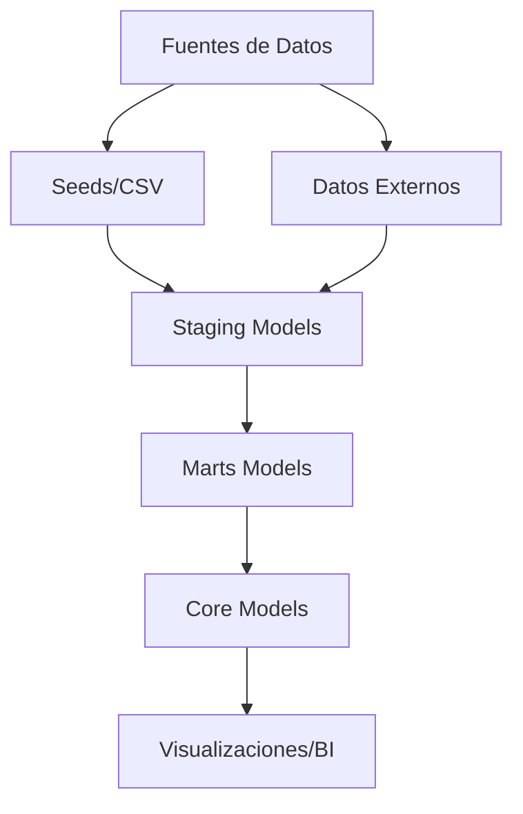
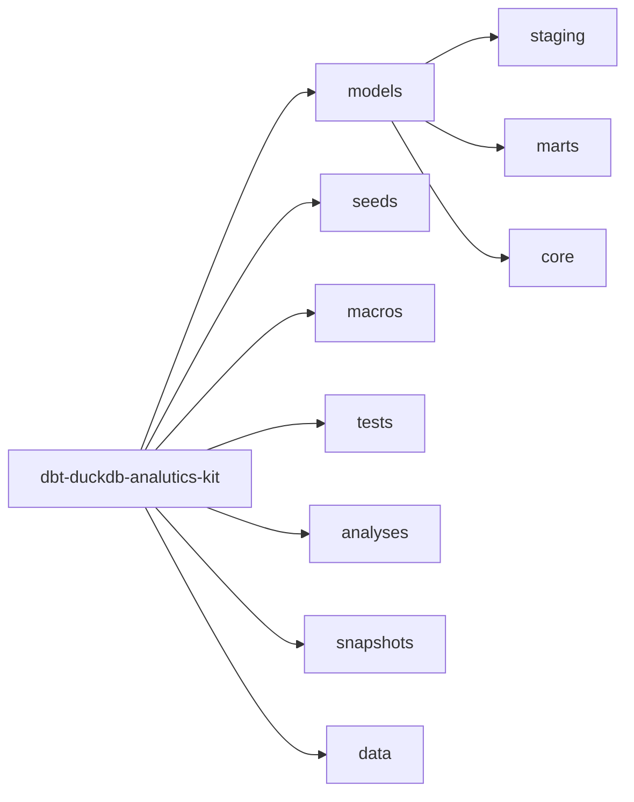
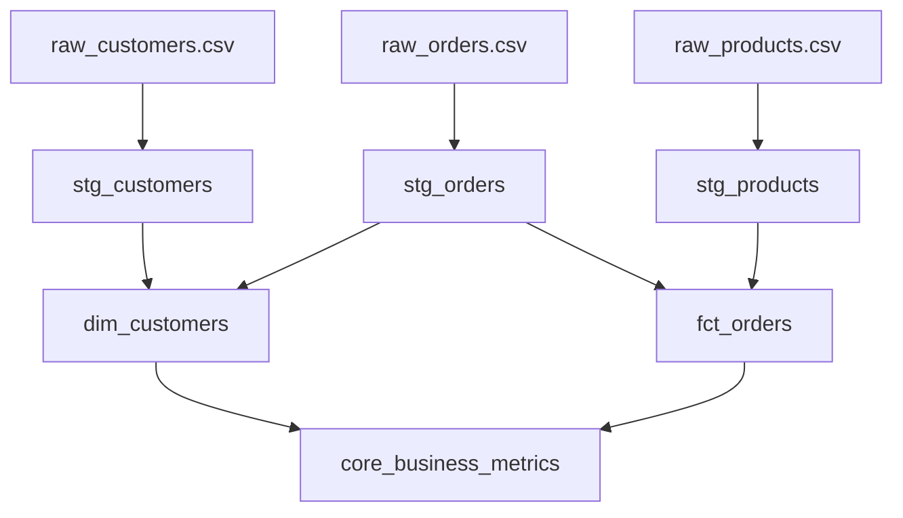
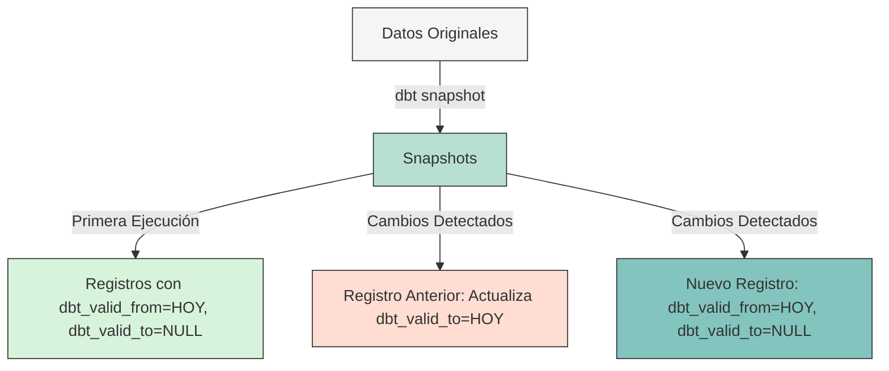
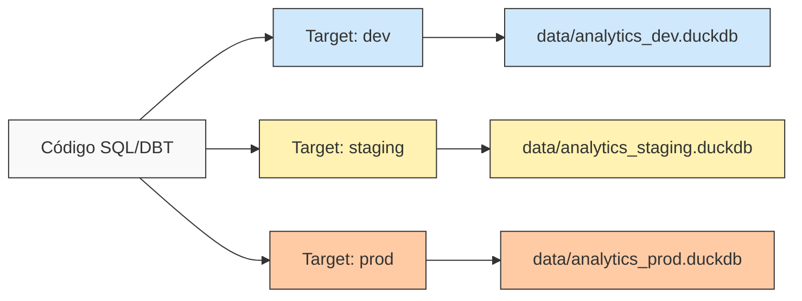
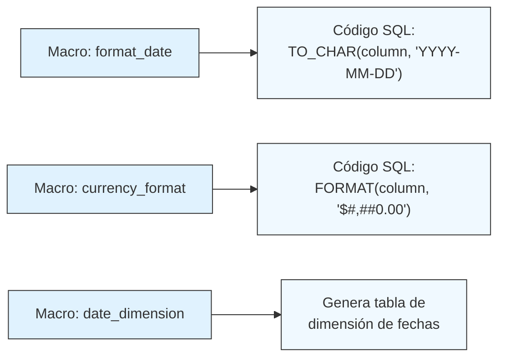
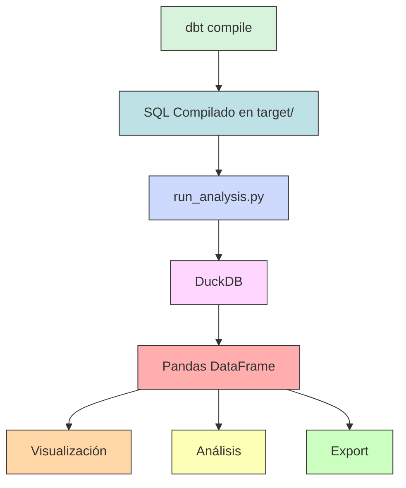

# DBT con DuckDB - Análisis de Datos Local

Este proyecto es una implementación completa de DBT (Data Build Tool) con DuckDB para realizar análisis de datos de forma local y eficiente, sin necesidad de una infraestructura compleja.

## Índice
- [1. Introducción](#1-introducción)
- [2. Arquitectura](#2-arquitectura)
- [3. Estructura del Proyecto](#3-estructura-del-proyecto)
- [4. Requisitos Previos y Instalación](#4-requisitos-previos-y-instalación)
- [5. Flujo de Trabajo Básico](#5-flujo-de-trabajo-básico)
- [6. Casos de Uso Prácticos](#6-casos-de-uso-prácticos)
- [7. Diagrama de Dependencias de Modelos](#7-diagrama-de-dependencias-de-modelos)
- [8. Trabajo con Snapshots](#8-trabajo-con-snapshots)
- [9. Entornos Múltiples](#9-entornos-múltiples)
- [10. Técnicas Avanzadas](#10-técnicas-avanzadas)
- [11. Solución de Problemas](#11-solución-de-problemas)
- [12. Integración con Python](#12-integración-con-python)
- [13. Exportación de Datos](#13-exportación-de-datos)
- [14. Mejores Prácticas](#14-mejores-prácticas)
- [15. Contribuir](#15-contribuir)
- [16. Licencia](#16-licencia)
- [17. Recursos Adicionales](#17-recursos-adicionales)
- [18. Conclusión](#18-conclusión)

## 1. Introducción

### 1.1 ¿Qué es DBT?

DBT (Data Build Tool) es una herramienta de transformación de datos que permite a los analistas y científicos de datos transformar datos de manera eficiente utilizando SQL. DBT se encarga de la orquestación, documentación y pruebas, permitiéndote concentrarte en escribir transformaciones.

### 1.2 ¿Qué es DuckDB?

DuckDB es una base de datos analítica embebida, diseñada para ser rápida, eficiente y fácil de usar. Es particularmente buena para análisis de datos y consultas OLAP (Online Analytical Processing), y puede funcionar como un archivo independiente similar a SQLite.

### 1.3 ¿Por qué utilizar DBT con DuckDB?

La combinación de DBT con DuckDB ofrece:
- Un flujo de trabajo de datos completamente local y portátil
- Transformaciones eficientes y rápidas
- Facilidad para modelar y transformar datos
- Capacidad de trabajar sin conexión
- Estructura modular y testeable para el código SQL

## 2. Arquitectura

La arquitectura de este proyecto sigue los principios de modelado dimensional y el patrón de medallón (bronze, silver, gold) para procesar y transformar datos:



## 3. Estructura del Proyecto



El proyecto está organizado en las siguientes componentes:

```
dbt-duckdb-analytics-kit/
├── models/             # Modelos SQL para transformación de datos
│   ├── staging/        # Modelos iniciales de limpieza
│   ├── marts/          # Modelos dimensionales para casos de uso
│   └── core/           # Modelos finales de alto nivel
├── analyses/           # Consultas SQL exploratorias
├── macros/             # Funciones SQL reutilizables
├── seeds/              # Archivos CSV de datos iniciales
├── snapshots/          # Capturas de cambios en datos
├── tests/              # Pruebas de calidad de datos
├── data/               # Directorio donde se almacena el archivo DuckDB
├── target/             # Archivos generados por DBT (ignorado en Git)
├── dbt_project.yml     # Configuración principal del proyecto
├── profiles.yml        # Configuración de conexión a DuckDB
└── README.md           # Documentación del proyecto
```

### 3.1 Capas de Datos

#### 3.1.1 Seeds (Semillas)
Los archivos CSV en la carpeta `seeds/` se utilizan como datos de entrada iniciales.

#### 3.1.2 Staging Models
Los modelos en `models/staging/` realizan la limpieza y normalización inicial de los datos sin agregar transformaciones complejas.

#### 3.1.3 Marts Models
Los modelos en `models/marts/` combinan datos de staging para crear dimensiones y tablas de hechos útiles para casos de uso específicos.

#### 3.1.4 Core Models
Los modelos en `models/core/` representan métricas y entidades de negocio altamente transformadas.

## 4. Requisitos Previos y Instalación

### 4.1 Requisitos Previos

- Python 3.8 o superior
- pip (gestor de paquetes de Python)
- Git

### 4.2 Instalación Paso a Paso

1. **Clonar el repositorio**:
   ```bash
   git clone https://github.com/tu-usuario/dbt-duckdb-analytics-kit.git
   cd dbt-duckdb-analytics-kit
   ```

2. **Crear entorno virtual e instalar dependencias**:
   ```bash
   # En macOS/Linux
   python3 -m venv venv
   source venv/bin/activate

   # En Windows
   python -m venv venv
   venv\Scripts\activate

   # Instalar dependencias
   pip install -r requirements.txt
   ```

3. **Configurar perfil de DBT**:
   ```bash
   # Crear directorio .dbt en tu directorio home si no existe
   mkdir -p ~/.dbt

   # Copiar el archivo profiles.yml
   cp profiles.yml ~/.dbt/
   ```

## 5. Flujo de Trabajo Básico

### 5.1 Inicializar Datos con Seeds

Los seeds son archivos CSV que se cargan directamente en la base de datos:

```bash
dbt seed
```

Este comando carga los archivos CSV de la carpeta `seeds/` en DuckDB.

### 5.2 Ejecutar Modelos

Para ejecutar todos los modelos y construir tu data warehouse:

```bash
dbt run
```

Ejecutar un modelo específico:
```bash
dbt run --select dim_customers
```

Ejecutar modelos en una capa específica (usar comillas para escapar el asterisco):
```bash
dbt run --select "staging.*"
```

### 5.3 Ejecutar Pruebas

Las pruebas garantizan la calidad e integridad de los datos:

```bash
# Ejecutar todas las pruebas
dbt test

# Ejecutar pruebas para un modelo específico
dbt test --select dim_customers
```

DBT soporta varios tipos de pruebas:
- **Pruebas genéricas**: unique, not_null, relationships, accepted_values
- **Pruebas personalizadas**: archivos SQL en la carpeta `tests/`

Estas pruebas se definen en los archivos `schema.yml`:

```yaml
version: 2
models:
  - name: dim_customers
    columns:
      - name: customer_id
        tests:
          - unique
          - not_null
      - name: email
        tests:
          - not_null
          - unique
```

### 5.4 Generar Documentación

```bash
# Generar documentación
dbt docs generate

# Servir documentación en un servidor web local
dbt docs serve
```

La documentación generada incluye:
- Lineage (diagrama de dependencias entre modelos)
- Definiciones de columnas
- Pruebas asociadas a cada modelo
- Código SQL subyacente

## 6. Casos de Uso Prácticos

### 6.1 Análisis de Clientes

Explora el comportamiento de los clientes y su segmentación:

```bash
# Primero compilar los análisis
dbt compile

# Ejecutar el análisis de clientes
python run_analysis.py customer_analysis
```

O para un análisis más detallado con patrones de compra:

```bash
python run_analysis.py customer_orders_analysis
```

### 6.2 Rendimiento de Productos

Analiza qué productos tienen mejor rendimiento:

```bash
python run_analysis.py product_performance
```

### 6.3 Tendencias de Ingresos

Examina las tendencias de ingresos a lo largo del tiempo:

```bash
python run_analysis.py order_trends_by_time
```

También puedes guardar los resultados en un archivo CSV:

```bash
python run_analysis.py revenue_trends --save
```

### 6.4 Resumen de Análisis Disponibles

- `customer_analysis` - Comportamiento de clientes y segmentación
- `customer_orders_analysis` - Análisis detallado de patrones de compra
- `product_performance` - Rendimiento de productos por categoría
- `order_trends_by_time` - Tendencias de ventas a lo largo del tiempo
- `revenue_trends` - Análisis de ingresos por producto y período
- `snapshot_history` - Historial de cambios en los datos

## 7. Diagrama de Dependencias de Modelos



## 8. Trabajo con Snapshots

Los snapshots capturan cambios en los datos a lo largo del tiempo, implementando el patrón SCD tipo 2:



```bash
# Ejecutar todos los snapshots
dbt snapshot
```

Esto creará tablas en el esquema `snapshots` que capturan el historial de cambios con columnas adicionales:
- `dbt_valid_from`: Fecha/hora desde cuando el registro es válido
- `dbt_valid_to`: Fecha/hora hasta cuando el registro es válido (NULL si es la versión actual)
- `dbt_updated_at`: Marca de tiempo usada para el seguimiento
- `dbt_scd_id`: Identificador único para cada versión del registro

### 8.1 Consultar Snapshots

Para ver los datos históricos:

```bash
# Consultar todos los registros de un snapshot
python run_query.py "SELECT * FROM snapshots.customers_snapshot ORDER BY customer_id, dbt_valid_from"

# Consultar solo registros actuales (versiones vigentes)
python run_query.py "SELECT * FROM snapshots.customers_snapshot WHERE dbt_valid_to IS NULL"

# Ver el historial de cambios de un registro específico
python run_query.py "SELECT * FROM snapshots.customers_snapshot WHERE customer_id = 1 ORDER BY dbt_valid_from"
```

Para un análisis más detallado de los cambios históricos:
```bash
python run_analysis.py snapshot_history
```

### 8.2 Nota sobre DuckDB y Snapshots

> **Importante**: En DuckDB, usa `current_timestamp` (sin paréntesis) en lugar de `current_timestamp()` en tus archivos de snapshot para evitar errores.

## 9. Entornos Múltiples

El proyecto está configurado para soportar múltiples entornos:



```bash
# Desarrollo
dbt run --target dev

# Staging
dbt run --target staging

# Producción
dbt run --target prod
```

Cada entorno utiliza un archivo DuckDB diferente para aislar los datos, como se define en `profiles.yml`.

## 10. Técnicas Avanzadas

### 10.1 Macros Personalizadas



Ejemplo de macro para formatear fechas:

```sql
-- macros/format_date.sql

    TO_CHAR({{ date_column }}, 'YYYY-MM-DD')

```

Uso:
```sql
SELECT {{ format_date('order_date') }} AS formatted_date
FROM {{ ref('fct_orders') }}
```

### 10.2 Plantillas Jinja

DBT utiliza Jinja2 para hacer el SQL más dinámico:

```sql

    SELECT 
        '{{ category }}' as category,
        SUM(total_revenue) as revenue
    FROM {{ ref('product_performance') }}
    WHERE product_category = '{{ category }}'
    UNION ALL

```

### 10.3 Materialización Incremental

Para tablas grandes que crecen con el tiempo:

```sql
{{
    config(
        materialized='incremental',
        unique_key='order_id'
    )
}}

SELECT * FROM {{ ref('stg_orders') }}


    WHERE order_date > (SELECT MAX(order_date) FROM {{ this }})

```

## 11. Solución de Problemas

### 11.1 Compilación sin Ejecución

Para ver el SQL generado sin ejecutarlo:

```bash
dbt compile --select my_model
```

El SQL compilado estará en `target/compiled/{proyecto}/{modelo}.sql`.

### 11.2 Conflictos con Funciones de Fecha/Hora en DuckDB

Si encuentras errores relacionados con funciones de fecha en DuckDB:
- Usa `CAST(columna AS DATE)` en lugar de `DATE(columna)`
- Usa `current_timestamp` sin paréntesis, no `current_timestamp()`

### 11.3 Errores Comunes y Soluciones

1. **Error con nombres de columnas**: Verifica que los nombres de columnas en tus transformaciones coincidan con los nombres reales en las tablas. Puedes usar `DESCRIBE tabla` para verificar.

2. **Error con ORDER BY y UNION ALL**: En DuckDB, cuando se utiliza ORDER BY o LIMIT dentro de una subconsulta que forma parte de UNION ALL, encierra la subconsulta entre paréntesis.

### 11.4 Depuración con --vars

Puedes pasar variables a tu proyecto:

```bash
dbt run --vars '{"min_date": "2023-01-01", "max_date": "2023-12-31"}'
```

Y usarlas en tu SQL:

```sql
SELECT * FROM {{ ref('stg_orders') }}
WHERE order_date BETWEEN '{{ var("min_date") }}' AND '{{ var("max_date") }}'
```

### 11.5 Logs de DBT

Los logs detallados se encuentran en:
```
logs/dbt.log
```

## 12. Integración con Python



Este proyecto incluye scripts de Python para facilitar el trabajo con los datos:

- `run_query.py` - Ejecuta una consulta SQL directamente en DuckDB
- `run_analysis.py` - Ejecuta análisis compilados por DBT

Ejemplo con pandas:
```python
import duckdb
import pandas as pd

# Conectar a la base de datos
conn = duckdb.connect('data/analytics_dev.duckdb')

# Consultar datos
df = conn.execute("SELECT * FROM main.core_business_metrics").fetchdf()

# Análisis con pandas
print(df.describe())

# Visualización con matplotlib
import matplotlib.pyplot as plt
df.plot(x='metric_name', y='metric_value', kind='bar')
plt.show()
```

## 13. Exportación de Datos

```bash
# Exportar a CSV
python run_query.py "COPY (SELECT * FROM main.dim_customers) TO 'exports/customers.csv' (HEADER, DELIMITER ',')"

# Exportar a Parquet
python run_query.py "COPY (SELECT * FROM main.fct_orders) TO 'exports/orders.parquet' (FORMAT PARQUET)"
```

## 14. Mejores Prácticas

```mermaid
mindmap
  root((Mejores<br>Prácticas))
    Nomenclatura
      ::icon(fa fa-code)
      stg_[fuente]_[entidad]
      dim_[entidad]
      fct_[entidad]
    Documentación
      ::icon(fa fa-file-text)
      schema.yml
      README.md
      Comentarios SQL
    Testing
      ::icon(fa fa-check-square)
      not_null
      unique
      referential_integrity
      Pruebas personalizadas
    Estructura
      ::icon(fa fa-sitemap)
      Modelos por capa
      Fuentes declaradas
      Snapshots para historial
    CI/CD
      ::icon(fa fa-refresh)
      Validación pre-commit
      Tests automatizados
      Documentación actualizada
```

### 14.1 Nomenclatura
- Modelos staging: `stg_[fuente]_[entidad]`
- Dimensiones: `dim_[entidad]`
- Hechos: `fct_[entidad]`
- Análisis: `[entidad]_[análisis]`

### 14.2 Documentación

Documenta tus modelos en los archivos `schema.yml`:

```yaml
version: 2
models:
  - name: dim_customers
    description: "Dimensión de clientes con métricas agregadas"
    columns:
      - name: customer_id
        description: "Identificador único del cliente"
        tests:
          - unique
          - not_null
```

### 14.3 Pruebas

Crea pruebas para garantizar la calidad de los datos:
- **Pruebas genéricas**: unique, not_null, relationships, accepted_values
- **Pruebas personalizadas**: archivos SQL en la carpeta `tests/`

Ejemplo de prueba personalizada (`tests/assert_positive_order_amount.sql`):
```sql
-- Esta prueba verifica que todas las órdenes tienen un monto positivo
SELECT
    order_id
FROM {{ ref('fct_orders') }}
WHERE net_order_amount <= 0
```

## 15. Contribuir

1. Crea un fork del proyecto
2. Crea una rama para tu característica (`git checkout -b feature/amazing-feature`)
3. Realiza tus cambios y haz commit (`git commit -m 'Add some amazing feature'`)
4. Sube los cambios a la rama (`git push origin feature/amazing-feature`)
5. Abre un Pull Request

## 16. Licencia

Este proyecto está licenciado bajo la Licencia MIT - ver el archivo [LICENSE](LICENSE) para más detalles.

## 17. Recursos Adicionales

- [Documentación oficial de DBT](https://docs.getdbt.com/)
- [Documentación de DuckDB](https://duckdb.org/docs/)
- [Guía de estilo de DBT](https://github.com/dbt-labs/corp/blob/main/dbt_style_guide.md)
- [Mejores prácticas para pruebas](https://docs.getdbt.com/docs/build/tests)
- [Comunidad DBT en Slack](https://community.getdbt.com/)

## 18. Conclusión

Este proyecto te proporciona una introducción completa al uso de DBT con DuckDB para análisis de datos. Has aprendido a configurar el proyecto, ejecutar modelos, realizar pruebas y utilizar técnicas avanzadas para transformar tus datos de manera eficiente y mantenible.

La combinación de DBT con DuckDB es particularmente potente para análisis de datos local y desarrollo rápido de flujos de trabajo de datos. A medida que te familiarices con estas herramientas, podrás desarrollar flujos de trabajo más complejos y obtener insights más profundos de tus datos.

---

¿Encontraste útil este proyecto? ¡Déjanos una ⭐ en el repositorio! 